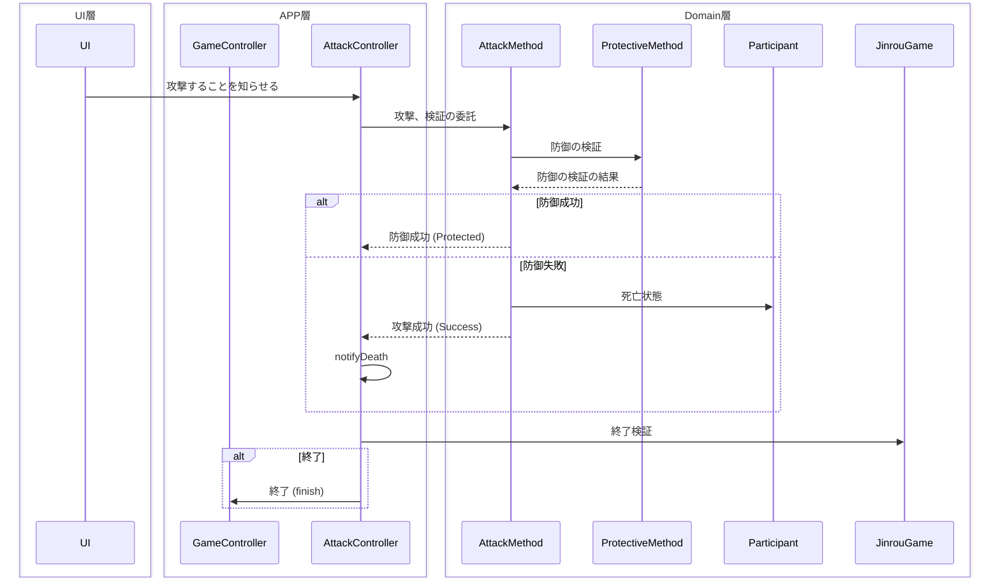

# 攻撃フロー

まず、全体のフロー図です。

```mermaid
sequenceDiagram
    box UI層
        participant UI
    end
    box APP層
        participant GC as GameController
        participant AC as AttackController
    end
    box Domain層
        participant AM as AttackMethod
        participant PM as ProtectiveMethod
        participant P as Participant
        participant G as JinrouGame
    end

    UI ->> AC: 攻撃することを知らせる
    AC ->> AM: 攻撃、検証の委託
    AM ->> PM: 防御の検証
    PM -->> AM: 防御の検証の結果
    alt 防御成功
        AM -->> AC: 防御成功 (Protected)
    else 防御失敗
        AM ->> P: 死亡状態
        AM -->> AC: 攻撃成功 (Success)
        AC ->> AC: notifyDeath
    end
    
    AC ->> G: 終了検証
    alt 終了
        AC ->> GC: 終了 (finish)
    end
```

ここで重要なのは、**UI** と **Controller** は、攻撃の検証をしないという点です。
攻撃の成功・失敗は全て **Method** に委託します。