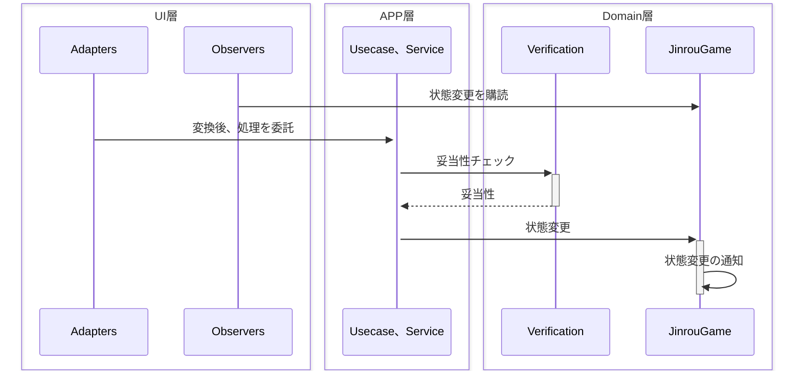
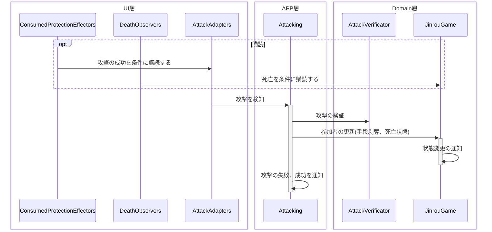

# 基本的なフロー

**Adapters**とは、そのイベントの元となるリスナー(OnAttack、OnChatなど)です。
また、このクラスは**状態変更や妥当性のチェックは基本的に行いません**。それらを行うのは全てAPP層です。
**UI的副作用**を行うときは、**全て変更や通知を購読する**ことで得られる情報から行います。
基本的にUI的副作用は、APP、Domain層から直接呼び出されることはありません。

# 攻撃フロー

まず、全体のフロー図です。

**攻撃の検知**はUIで行いますが、UIは変換以外の処理を行いません。
**妥当性、状態の変更**といったことはすべてAPP層に委託されます。

