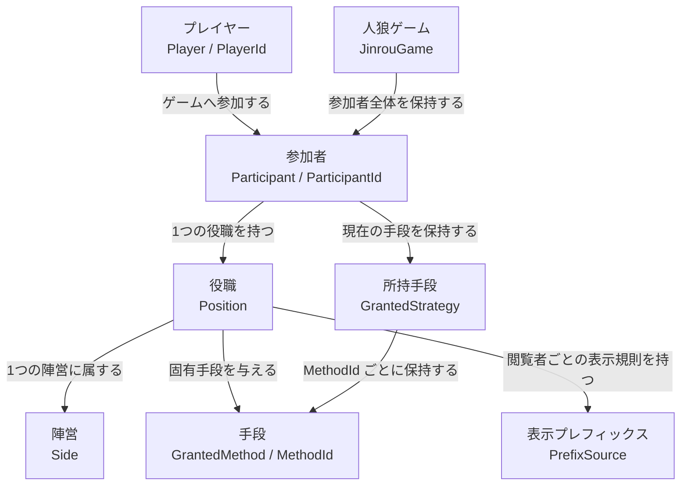
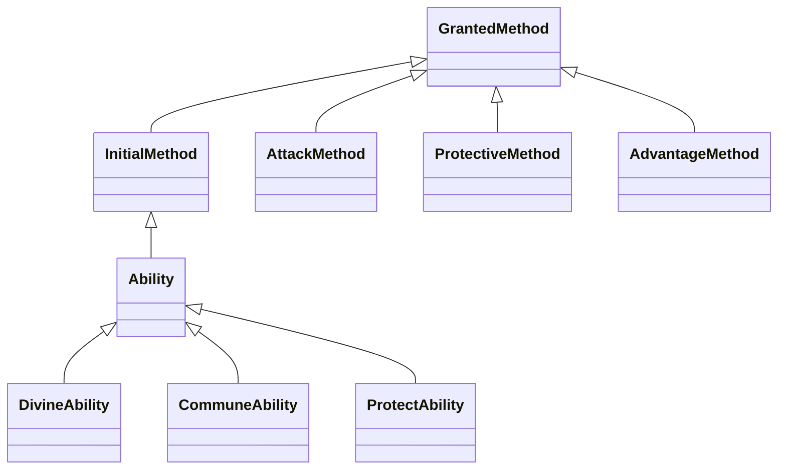

# Bakajinrou API ドメイン用語集

この文書は `Bakajinrou-API` に存在するドメイン概念と、コード上で使用する名前を定義します。
実装・会話・ドキュメントでは、原則としてここに記載した用語を同じ意味で使用します。

対象は `Bakajinrou-API/src/main/kotlin/com/github/tanokun/bakajinrou/api` 配下です。
Minecraft、Paper、GUI、マップ座標などに依存する概念は API の外側に置きます。

## 用語の関係

## 基本となる用語

### プレイヤー — Player

Minecraft 上の人物を、ゲームへの参加形態に依存せず表す概念です。
API では `PlayerId` だけを定義し、Bukkit の `Player` には依存しません。

- `PlayerId`: プレイヤーを一意に識別する値。現在は Minecraft の UUID を包みます。
- `UUID.asPlayerId()`: UUID を `PlayerId` に変換します。

### 参加者 — Participant

一回の人狼ゲームへ参加しているプレイヤーを表す不変オブジェクトです。
`ParticipantId` によって同一性を判定し、役職、所持手段、プレイ状態、カミングアウトを保持します。
状態や所持手段を変更する操作は、新しい `Participant` を返します。

- `ParticipantId`: ゲーム内の参加者を識別する値。`PlayerId` を参加者の文脈で包みます。
- `UUID.asParticipantId()`: UUID を `ParticipantId` に変換します。
- `playerId`: 参加者に対応するプレイヤーの ID です。
- `position`: 参加者の役職です。
- `strategy`: 参加者が現在所有する手段の集合です。
- `state`: 参加者の現在のプレイ状態です。
- `comingOut`: 参加者が公称している役職です。実際の役職とは独立しています。

`PlayerId` と `ParticipantId` は現在同じ UUID に由来しますが、意味は異なります。
ゲーム参加前後をまたぐ識別には `PlayerId`、ゲーム内の参加者を指定する場合は `ParticipantId` を使用します。

### 人狼ゲーム — JinrouGame

一回のゲームに属する全参加者と、参加者に基づく勝敗規則を保持する集約です。
`Participant` と同様に、更新操作は新しい `JinrouGame` を返します。

- 参加者の追加と更新では `ParticipantId` の一意性を維持します。
- 勝敗判定では生存中の参加者だけを数えます。
- 排他制御、永続化、変更通知、UI の副作用は API の責務に含めません。

### 参加者スコープ — ParticipantScope

参加者の集合をドメイン操作付きで表す値です。
現在の具体型は「対象ゲームの全参加者」を表す `ParticipantScope.All` です。

- `includes`: 条件に一致する参加者だけを残します。
- `excludes`: 条件に一致する参加者、または指定 ID の参加者を除外します。
- `survivedOnly`: `ALIVE` の参加者だけを残します。
- `ParticipantFilter`: 参加者を判定する関数です。`and` と `or` で合成できます。
- `Iterable<Participant>.all()`: 参加者列を `ParticipantScope.All` に変換します。

### 参加者差分 — ParticipantDifference

参加者の更新前後を表す値です。
新規参加など更新前が存在しない場合、`before` は `null` になります。

### プレイ状態 — ParticipantStates

参加者がゲームを続行できるか、死亡しているかを表します。

| 値 | 意味 | 許可される主な遷移 |
| --- | --- | --- |
| `ALIVE` | 生存し、ゲームを続行している | `DEAD` または `SUSPENDED` |
| `SUSPENDED` | 生存を維持したまま一時的に参加を中断している | `ALIVE` |
| `DEAD` | 死亡している | API 上は遷移なし |

`SUSPENDED` は死亡や役職ではありません。ログアウトなど、復帰可能な中断を表します。

## 役職と陣営

### 役職 — Position

参加者に割り当てられる役割です。各役職は次の情報を持ちます。

- `side`: 勝敗が帰属する陣営。
- `divinedAs`: 占い・霊媒から見える判定結果。
- `prefixSource`: 閲覧者に応じて役職名を表示する規則。
- `inherentMethods()`: ゲーム開始時に付与する、その役職固有の手段。

### 陣営 — Side

勝敗の帰属先です。

| 値 | 日本語 |
| --- | --- |
| `VILLAGE` | 村人陣営 |
| `WEREWOLF` | 人狼陣営 |
| `FOX` | 妖狐陣営 |

役職と陣営は同じ概念ではありません。
例えば狂人は `MadmanPosition` という役職ですが、陣営は `WEREWOLF` です。

### 役職の一覧

| API 型 | 用語 | 陣営 | 占い・霊媒結果 | 固有手段・規則 |
| --- | --- | --- | --- | --- |
| `CitizenPosition` | 市民 | 村人 | 市民 | なし |
| `FortunePosition` | 占い師 | 村人 | 市民 | 正しい占い |
| `MediumPosition` | 霊媒師 | 村人 | 市民 | 正しい霊媒 |
| `KnightPosition` | 騎士 | 村人 | 市民 | 本物の加護 |
| `IdiotAsFortunePosition` | バカ占い | 村人 | 市民 | 偽の占い |
| `IdiotAsMediumPosition` | バカ霊媒 | 村人 | 市民 | 偽の霊媒 |
| `IdiotAsKnightPosition` | バカ騎士 | 村人 | 市民 | 偽の加護 |
| `WolfPosition` | 人狼 | 人狼 | 人狼 | 指定された狂人にだけ正体を公開できる |
| `MadmanPosition` | 狂人 | 人狼 | 市民 | 設定により偽の加護を持つ |
| `FoxPosition` | 妖狐 | 妖狐 | 妖狐 | なし |

役職の分類型は次の意味で使用します。

- `CitizensPosition`: 村人陣営の役職。
- `MysticPosition`: 本物の能力を持つ村人陣営の役職。
- `IdiotPosition`: 偽の能力と偽の自己表示を持つ村人陣営の役職。

`isCitizen`、`isWolf`、`isMystic` などの `PositionHelper` は、役職判定をドメイン用語で記述するための関数です。

### 判定結果 — ResultSource

占いと霊媒から見える分類です。
陣営そのものではなく、能力を行使した結果として表示される値です。

- `WOLF`: 人狼と判定される。
- `FOX`: 妖狐と判定される。
- `CITIZENS`: 市民と判定される。

狂人やバカ系役職は人狼陣営または特殊役職であっても、判定結果は `CITIZENS` です。

## 手段と Strategy

### 手段 — GrantedMethod

参加者が所有し、ゲーム内の行動や効果の根拠となるオブジェクトです。
すべての手段は次の情報を持ちます。

- `MethodId`: 手段の個体を一意に識別する ID。
- `assetKey`: 表示名やアイテム表現を引くためのキー。
- `reason`: 手段が付与された理由。
- `transportable`: 他の参加者へ譲渡可能か。
- `asTransferred()`: 譲渡後の手段を作る操作。

同じ種類の手段でも、`MethodId` が異なれば別の個体です。
UUID からは `UUID.asMethodId()` で変換します。

### 初期手段 — InitialMethod

役職がゲーム開始時に与えることのできる手段です。
`GrantedMethod` の一種で、クラフト由来の個体へ変換する `asCrafted()` を持ちます。

### 所持手段 — GrantedStrategy

参加者が現在所有する `GrantedMethod` を、`MethodId` ごとに保持する値です。
付与、剥奪、検索と、有効な防御手段の優先順取得を担当します。

名前に `Strategy` を含みますが、現在の責務は「アルゴリズムの選択」ではなく「所持手段の集合」です。
会話や仕様では曖昧な「ストラテジー」だけで呼ばず、原則として「所持手段」または `GrantedStrategy` と呼びます。

### 付与理由 — GrantedReason

| 値 | 意味 |
| --- | --- |
| `INITIALIZED` | 役職などによりゲーム開始時に付与された |
| `CRAFTED` | クラフトによって得た |
| `TRANSFERRED` | 他の参加者から譲渡された |
| `SYSTEM` | システム処理によって付与された |

### 手段差分 — MethodDifference

参加者の所持手段に生じた一件の差分です。

- `Granted`: 手段が付与された。
- `Removed`: 手段が剥奪された。

### 手段の分類

| 分類 | API 型 | 意味 |
| --- | --- | --- |
| 能力 | `Ability` | 主に役職固有で、初期付与される手段 |
| 攻撃手段 | `AttackMethod` | 他の参加者を攻撃する根拠 |
| 防御手段 | `ProtectiveMethod` | 攻撃手段に対する防御の候補 |
| 有利手段 | `AdvantageMethod` | 位置交換、移動速度、透明化などの補助効果 |

## 能力

### 占い — DivineAbility

対象参加者を `WOLF`、`FOX`、`CITIZENS` のいずれかに判定します。

- `CorrectDivineAbility`: 対象役職の `divinedAs` を返す正しい占い。
- `FakeDivineAbility`: 実際の役職に関係なくランダムな結果を返す偽の占い。

### 霊媒 — CommuneAbility

対象参加者の判定結果を取得します。
結果は `CommuneResultSource` で表します。

- `FoundResult`: 判定結果を取得できた。
- `NotDeadError`: 死亡していない対象など、結果を取得できない状態。
- `CorrectCommuneAbility`: 死亡者に対して実際の `divinedAs` を返す正しい霊媒。
- `FakeCommuneAbility`: ランダムな判定または失敗を返す偽の霊媒。

### 加護 — ProtectAbility

直接攻撃を防ぐ能力ではなく、対象参加者へ付与する `ProtectiveMethod` を生成する能力です。

- `RealProtectAbility`: 攻撃を防ぐ `TotemMethod` を生成する本物の加護。
- `FakeProtectAbility`: 攻撃を防げない `FakeTotemMethod` を生成する偽の加護。

能力は現在すべて譲渡不可です。

## 攻撃と防御

### 攻撃手段 — AttackMethod

攻撃の種類を表します。実際の成功・防御判定は `AttackVerificator` が行います。

| API 型 | 用語 | 譲渡 |
| --- | --- | --- |
| `SwordMethod` | 剣 | 可 |
| `GasMethod` | ガス | 可 |
| `ArrowMethod` | 一撃弓 | 不可 |
| `ScatterCrossbowMethod` | 拡散クロスボウ | 不可 |

### 防御手段 — ProtectiveMethod

攻撃を防御できるかを判定する手段です。
有効な防御手段は `ActivationPriority` の `HIGH`、`NORMAL`、`LOW` の順で試行・消費されます。

| API 型 | 用語 | 優先度 | 防御規則 |
| --- | --- | --- | --- |
| `ShieldMethod` | 盾 | `HIGH` | 一撃弓と拡散クロスボウを防ぐ |
| `FakeTotemMethod` | 偽トーテム | `HIGH` | すべての攻撃に失敗する |
| `ResistanceMethod` | 耐性 | `NORMAL` | すべての攻撃を防ぐ |
| `TotemMethod` | トーテム | `LOW` | すべての攻撃を防ぐ |

`ProtectVerificator` は、アイテム装備など API の外にある状態を問い合わせるための境界です。
防御結果は `ProtectResult.PROTECTED` または `ProtectResult.FAILURE` で表します。

### 攻撃判定 — AttackVerificator

攻撃手段と被害者の有効な防御手段を照合するドメインサービスです。
防御手段を優先順に試し、防御が成功するまでに試した手段を「消費対象」として返します。
このサービス自体は参加者を死亡させたり、手段を剥奪したりしません。

結果は `AttackByMethodResult` で表します。

- `Protected`: 防御に成功した。
- `SucceedAttack`: 攻撃に成功した。
- `consumedProtectiveMethods`: 判定中に消費対象となった防御手段。

## 有利手段

### 有利手段 — AdvantageMethod

参加者に有利な補助効果を与える譲渡可能な手段です。

| API 型 | 用語 | 意味 |
| --- | --- | --- |
| `ExchangeMethod` | 位置交換 | 別の参加者と位置を交換する |
| `SpeedMethod` | 移動速度 | 移動速度上昇を得る |
| `InvisibilityMethod` | 透明化 | 透明化を得る |

API では手段の存在と識別を定義し、効果時間、Minecraft の PotionEffect、アイテム操作は外側の層で扱います。

### 交換対象選択 — ExchangeSelector

位置交換の候補となる `ParticipantId` の集合から、使用者自身を除外して一人をランダムに選びます。
死亡者、ログアウト者、マップギミック中の参加者などを候補から除外する責務は、呼び出し側にあります。

## 表示に関する用語

### プレフィックス — PrefixSource

閲覧者 `viewer` と表示対象 `target` の関係から、表示する役職プレフィックスのキーを決定する規則です。
ここでいう Prefix は Minecraft の scoreboard tag の接頭辞ではありません。

| API 型 | 表示規則 |
| --- | --- |
| `DefaultPrefix` | 死亡者と本人にだけ実役職を表示する |
| `LiteralPrefix` | 全員に同じプレフィックスを表示する |
| `IdiotPrefix` | 死亡者には実役職、本人には偽役職を表示する |
| `WolfPrefix` | 死亡者、人狼、指定された狂人、本人に人狼を表示する |
| `ComingOut` | 全員に公称役職を表示する |

### カミングアウト — ComingOut

参加者が公称する役職表示です。実際の `Position` を変更しません。

- `LAST_WOLF`: ラストウルフ
- `FORTUNE`: 占い師
- `MEDIUM`: 霊媒師
- `KNIGHT`: 騎士

### 翻訳キー — TranslationKey

表示文言やアセットをローカライズするための、`a-z` と `.` だけで構成されたキーです。

- `PrefixKeys`: 役職プレフィックス用。
- `MethodAssetKeys`: 手段の表示・アセット用。`Attack`、`Protective`、`Advantage`、`Ability` に分類されます。
- `AbilityKeys`: 能力結果用。

キーの分類型として、`PrefixKeys.Idiot`、`PrefixKeys.Mystic`、`PrefixKeys.ComingOut`、
`MethodAssetKeys.Attack`、`MethodAssetKeys.Protective`、`MethodAssetKeys.Advantage`、
`MethodAssetKeys.Ability`、`AbilityKeys.Result` が存在します。

翻訳キーは表示先を識別する値であり、ドメインオブジェクトの同一性を表す ID ではありません。

## ゲーム終了、チャット、通知

### ゲーム終了結果 — WonInfo

ゲームが終了した理由と、終了時点の全参加者を表します。

- `Won`: `Side` のいずれかが勝利した。
- `System`: システム都合で強制終了した。

### チャット整合性 — ChatIntegrity

送信者と受信者の状態から、チャットを届けてよいか判定するドメインサービスです。
現在の実装では、死亡していない参加者の発言は全員へ届き、死亡者の発言は死亡者と本人にだけ届きます。

### Observer

インスタンス生成と同時に購読を開始するコンポーネントであることを示すマーカーです。
これはゲーム状態そのものではなく、API の変更を外側の層へ伝えるための境界上の用語です。

## API 外の概念との境界

次の概念はゲーム仕様上重要ですが、現時点では `Bakajinrou-API` のドメイン型ではありません。

- マップ、マップギミック、ギミック ID
- ArmorStand と scoreboard tag
- クォーツの所持数と消費
- 商人、取引、Minecraft アイテム
- PotionEffect と効果時間
- テレポート先や座標

これらは現在 `Bakajinrou-Plugin` など外側の層で扱います。
今後、複数のマップや UI から共通利用する純粋なゲーム規則が生じた場合は、Minecraft 型に依存しない形で API に追加します。
拡散クロスボウでは、手段の個体と攻撃種別を API、発射物・装填・耐久値・三方向への射出を Plugin 層で扱います。
