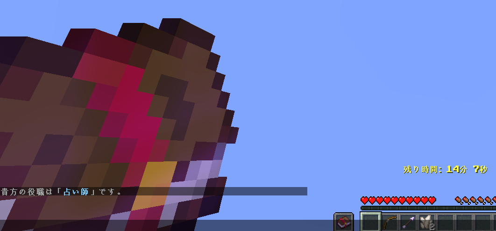
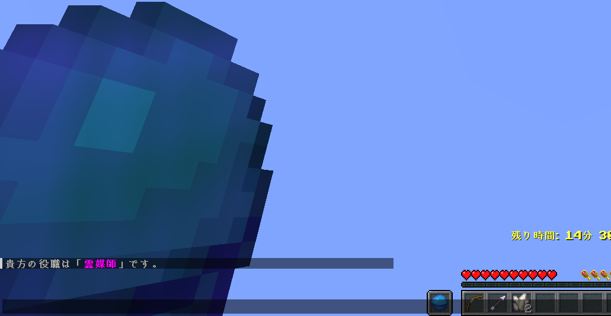
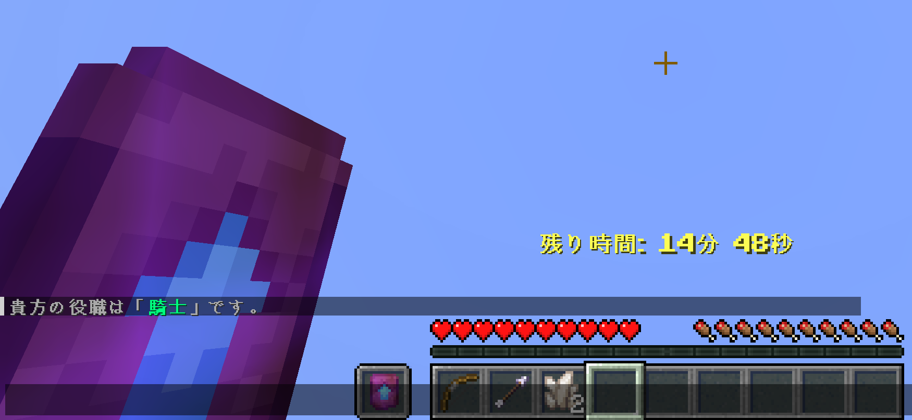
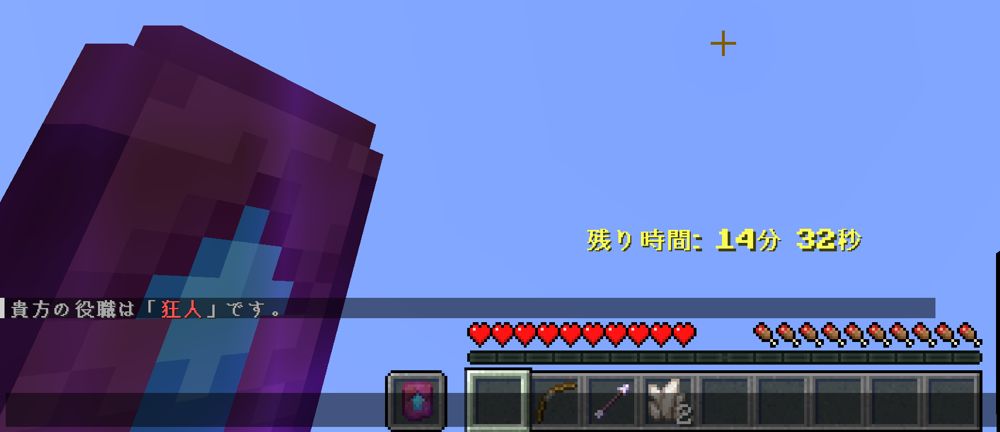

# タブリストの解禁
ゲーム中のタブリストが使用可能になりました。
また、**プレイヤー事に見ることのできる情報が違います**。

## 霊媒師から見たタブ

## 人狼から見たタブ

# 死体の変更
死体に**直接的な当たり判定は存在しません**。

# 能力の直感的な操作
従来の番号式を廃止し、**GUI上で操作**できるようにしました。
また、GUIを表示する方法として、**アイテムのクリックを採用**しています。

# 狂人の騙り
従来では、狂人が騎士を騙ることはシステム上難しく、 
**暗黙の了解が存在していました**。
そこで、一定確率で **バカ騎士** と同等の振る舞いをすることができます。

# 耐性のポーションの強化
従来では、**一度ダメージを受ける** *(殴りなど)* 事で効果がなくなりましたが、
今回は、**正しい攻撃以外で効果が無くなることはありません**。

# TPフレームの教科
従来では、**自分を含めたランダムなプレイヤー**にテレポートしますが、
それを止めて**自分以外のプレイヤーにテレポート**するようにしました。

これは実質的な人狼側の強化かもしれません。
しかし、**圧倒的少人数での村の逃げ切り**や、
**逆に大人数で自分を引いた時**の批判が多い事から、この変更にしました。

ここは相談、鯖民の統計などで決定したいです。

# 