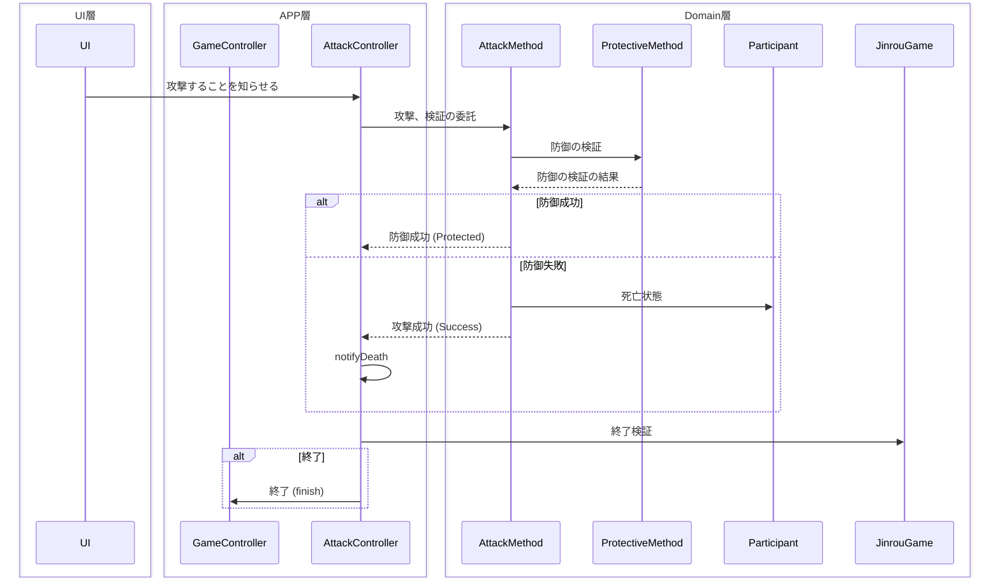

# 関心(用語)
## 行動
何かの形としての実体はなく、振る舞いを持ちません。

### 攻撃 - Attack
**攻撃**とは、`トリガー ⇒ 防御 ⇒ 死亡` の一連の流れを指す。

**UI**と**AttackController** 自体に攻撃の実体は存在せず、
この2つはあくまでドメインに委託します。
[攻撃](#攻撃---attack) はあくまで行動であり、実際の振る舞いは表しません。

### 防御 - Protective
[防御](#防御---Protective) は、[攻撃](#攻撃---attack) があって初めて成り立ちます。自身から行動することはなく、

## 手段 - Method
行動を行うために必要な [手段](#手段---method) を表します。
[手段](#手段---method) には振る舞いが存在し、実際の処理を行います。

### 攻撃手段 - AttackMethod
主に、攻撃の振る舞いを持ち、 [防御](#防御---Protective) の選択と剥奪を行います。
責務として、参加者の状態を変更します。

### 防御手段 - ProtectiveMethod
主に、 [攻撃手段](#攻撃手段---attackmethod) に対する振る舞いを持ちます。
単体で機能することはなく、基本的に前提として [攻撃手段](#攻撃手段---attackmethod) が存在します。